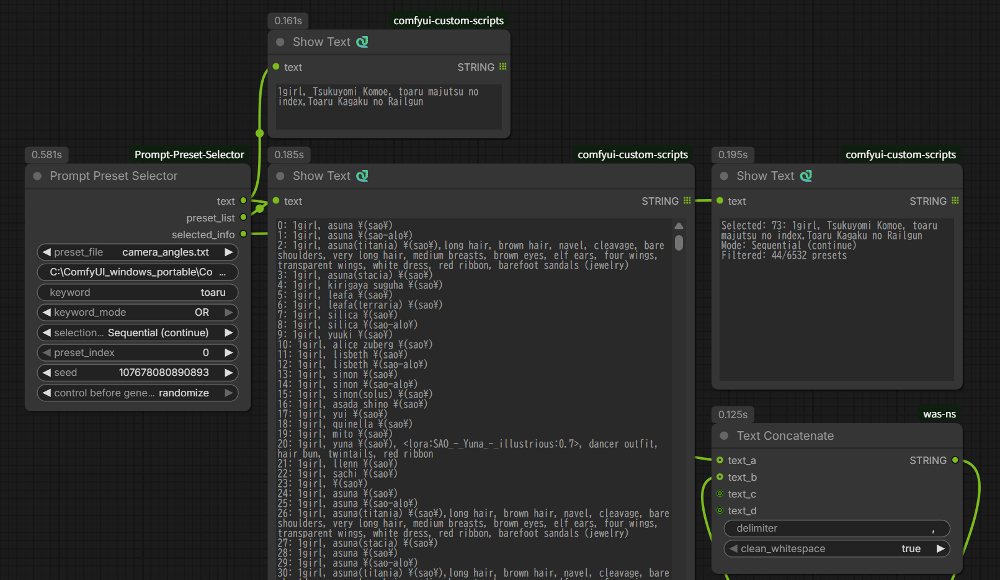
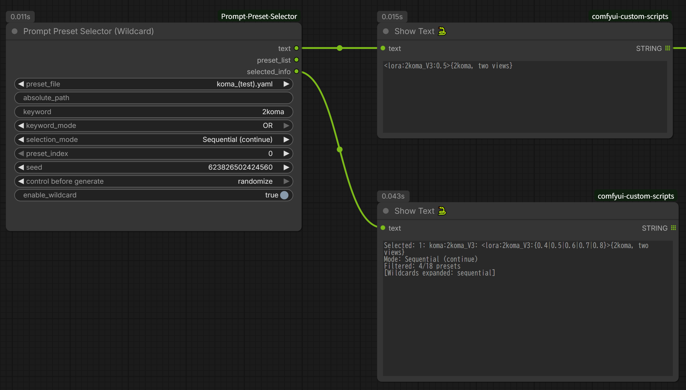
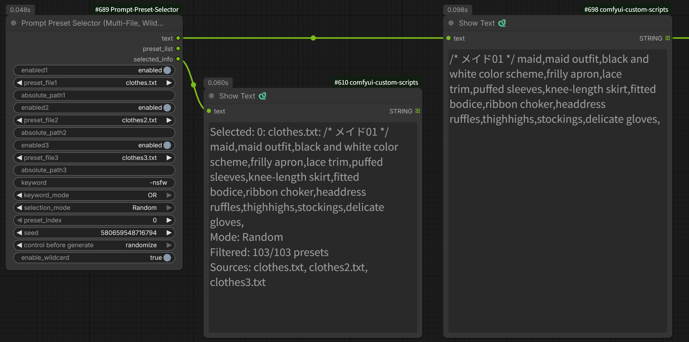
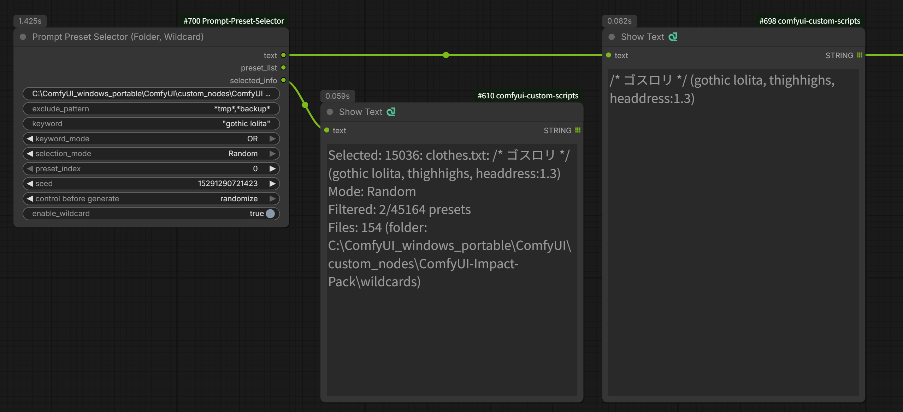

# ComfyUI Prompt Preset Selector

[English](README.md) | [日本語](README_ja.md)

A flexible ComfyUI node for selecting text presets from external files with advanced filtering capabilities. Perfect for managing camera angles, clothing descriptions, lighting setups, character databases, or any text-based presets.






## Features

- 📁 **External File Management**: Store presets in `.txt`, `.yaml`, or `.yml` files
- 🌐 **Absolute Path Support**: Use files from anywhere on your system
- 📝 **Multiple YAML Formats**: Supports list, nested dict, and flat formats
- 🔍 **Advanced Keyword Filtering**: Include/exclude keywords with phrase support
- 🎲 **Multiple Selection Modes**: Manual, Sequential, Sequential (continue), Random
- 🎰 **Wildcard Expansion**: Supports `{A|B|C}`, `__filename__`, and `{__key__|__key__}` syntax
- 🔄 **ComfyUI-Impact-Pack Integration**: Compatible with wildcards folder
- 📝 **Easy Editing**: Edit presets with any text editor - no need to touch Python code
- 🗂️ **Multiple Preset Files**: Organize presets by category
- 🔀 **Multi-File Search**: Search across up to 3 files at once, each with its own on/off toggle
- 📂 **Folder Search**: Recursively search every preset file under a folder, with exclude patterns
- 💬 **Comment Support**: Add comments and empty lines in preset files for organization
- 🔄 **Dynamic Loading**: No ComfyUI restart needed when editing preset files

## Node Types

This extension provides four nodes:

### Prompt Preset Selector
Basic preset selection functionality. Use when wildcard expansion is not needed.

### Prompt Preset Selector (Wildcard)
Enhanced version with wildcard expansion support:
- `{A|B|C}` - Select one option from choices
- `__filename__` - Load a line from a file in the wildcards folder
- `{__key__|__key__}` - Select content from YAML keys (Impact Pack format)

### Prompt Preset Selector (Multi-File, Wildcard)
Searches up to 3 preset files at the same time, so you don't have to merge files with different formats by hand. Each file slot has its own on/off toggle, dropdown, and absolute path field. Full wildcard support.

### Prompt Preset Selector (Folder, Wildcard)
Recursively searches every `.txt` / `.yaml` / `.yml` file under a given folder, with optional exclude patterns. Full wildcard support.

## Installation

1. Navigate to your ComfyUI custom nodes directory:
```bash
cd ComfyUI/custom_nodes
```

2. Clone this repository:
```bash
git clone https://github.com/shin131002/ComfyUI-Prompt-Preset-Selector.git
```

3. (Optional) Install PyYAML if not already installed (for YAML support):
```bash
pip install pyyaml
```

Note: PyYAML is usually already installed in most environments. The node will display a warning if YAML files cannot be loaded.

4. Restart ComfyUI

## Usage

### Basic Usage

1. Add **"Prompt Preset Selector"** or **"Prompt Preset Selector (Wildcard)"** node to your workflow
2. **Option A**: Select a preset file from the dropdown (e.g., `camera_angles.txt`)
   **Option B**: Enter an absolute path in the `absolute_path` field (e.g., `/home/user/my_presets/styles.yaml`)
3. Choose an execution mode
4. Connect the `text` output to your prompt node

**Note**: If `absolute_path` is provided, it takes priority over the `preset_file` dropdown.

### File Locations

Preset files are loaded from the following locations (in priority order):

1. **Absolute path** - When specified in the `absolute_path` field
2. **presets folder** - `ComfyUI/custom_nodes/ComfyUI-Prompt-Preset-Selector/presets/`
3. **wildcards folder** - `ComfyUI/custom_nodes/ComfyUI-Impact-Pack/wildcards/` (when Impact Pack is installed)

The dropdown displays files from both the presets and wildcards folders (duplicates are excluded).

### Using Absolute Paths

You can use preset files from anywhere on your system:

```
/home/user/presets/camera_angles.txt
/mnt/shared/prompts/styles.yaml
C:\Users\YourName\Documents\presets\lighting.yml  (Windows)
```

Supported file types: `.txt`, `.yaml`, `.yml`

### Multi-File and Folder Search

When presets are spread across several files with different formats, merging them into one file by hand is tedious. The Multi-File and Folder nodes search across multiple files at once instead.

Both nodes prefix every line with the file it came from, so the normal keyword search can narrow results down to a single file.

#### Prompt Preset Selector (Multi-File, Wildcard)

Three independent file slots. Each slot has:

| Field | Description |
|-------|-------------|
| `enabled{n}` | Turn the slot on/off without clearing its settings |
| `preset_file{n}` | Dropdown, same as the basic node |
| `absolute_path{n}` | Absolute path (takes priority over that slot's dropdown) |

Lines are prefixed with the file name:

```
colors.txt: red
colors.txt: blue
camera_angles.yaml: camera_angles:close_up: front view, low-angle shot
```

Narrow to one file by searching its prefix:

```
Keyword: colors.txt:
```

Presets are numbered in slot order (slot 1, then 2, then 3), and within each file in its original order. Disabling a slot removes its lines from the list entirely, which shifts the indices of later slots.

#### Prompt Preset Selector (Folder, Wildcard)

Loads every `.txt` / `.yaml` / `.yml` file under `folder_path`, including subfolders.

| Field | Description |
|-------|-------------|
| `folder_path` | Absolute path to the folder to search |
| `exclude_pattern` | Optional glob patterns, comma-separated |

Lines are prefixed with the path relative to `folder_path`, so identically named files in different subfolders don't collide:

```
colors.txt: red
sub/colors.txt: crimson
```

Files are loaded in alphabetical order of their relative path, so `preset_index` stays stable between runs.

##### exclude_pattern Syntax

**Basic rules**

- Separate multiple patterns with a **comma or a newline**. Surrounding whitespace is trimmed.
- Each pattern is matched using Python's `fnmatch`.
- Every pattern is tested against **both** the path relative to `folder_path` **and** the bare file name. A match on either one excludes the file.
- Matching is a **full match, not a substring match**. `backup` on its own matches nothing — write `*backup*`.
- Leaving the field empty excludes nothing.

**Supported wildcards**

| Symbol | Meaning |
|--------|---------|
| `*` | Zero or more characters (**including `/`**) |
| `?` | Exactly one character |
| `[abc]` | Any one character inside the brackets |
| `[!abc]` | Any one character *not* inside the brackets |

**Examples**

Given this folder:

```
a.txt
b_backup.txt
notes.yaml
tmp_draft.txt
sub/a.txt
sub/deep/c.txt
Backup/old.txt
```

| Pattern | Files excluded |
|---------|----------------|
| `sub/*` | `sub/a.txt`, `sub/deep/c.txt` (the whole subtree) |
| `sub` | Nothing — a bare folder name never matches |
| `*_backup*` | `b_backup.txt` |
| `tmp_*, *_backup*` | `tmp_draft.txt`, `b_backup.txt` |
| `*.yaml` | `notes.yaml` |
| `sub/a.txt` | `sub/a.txt` only |
| `*/deep/*` | `sub/deep/c.txt` |
| `?.txt` | `a.txt`, `sub/a.txt`, `sub/deep/c.txt` |

**⚠️ Three things to watch for**

**1. `*` crosses `/`.**
`*.txt` excludes `sub/deep/c.txt` as well as the top-level files — unlike a normal shell glob, where `*` stops at a directory separator. There is currently no way to exclude only the `.txt` files sitting directly inside `folder_path`.

**2. File names are matched too, so same-named files are caught together.**
`a.txt` also excludes `sub/a.txt`. Excluding *only* the top-level `a.txt` is not possible, because its relative path and its file name are the same string. To target just the one in the subfolder, write the full relative path: `sub/a.txt`.

**3. Case sensitivity follows the operating system.**
`fnmatch` respects platform conventions, so `backup/*` does **not** match `Backup/old.txt` on Linux/macOS, but **does** on Windows. Worth remembering if you share a workflow across a dual-boot setup.

**Common patterns**

```
*_backup*, *_bak*   → Backup files
tmp_*, *_wip*       → Drafts and work in progress
_archive/*          → An entire archive folder
*.yml               → A single extension, at every level
```

#### Cross-File YAML Key References

In both nodes, `{__key__|__key__}` searches keys across **all** loaded files, so keys defined in separate YAML files can reference each other:

```yaml
# heroes.yaml
heroes:
  - superman, red cape, blue suit

# sidekicks.yaml
sidekicks:
  - robin, red vest, yellow cape

# characters.yaml
characters:
  all:
    - {__heroes__|__sidekicks__}
```

Selecting `all` picks from either file. If the same top-level key exists in more than one file, the file loaded later wins.

#### When Nothing is Selected

If no source is active (all slots disabled, folder empty or missing, or no preset matches the keyword), the node outputs an empty string and the workflow continues normally. It does not raise an error or halt the queue. The reason is shown in `selected_info`.

### Wildcard Features (Wildcard Node Only)

#### enable_wildcard Parameter
- `true` (default): Expand wildcard syntax
- `false`: Output wildcard syntax as plain text

Generally, keeping it at `true` is recommended. If there's no wildcard syntax, it will output text normally.

#### Supported Wildcard Syntax

##### 1. Choice Expansion: `{A|B|C}`
```
{red|blue|green} dress
→ "red dress", "blue dress", or "green dress"
```

Supports nesting:
```
{red|{dark|light} blue} dress
→ "red dress", "dark blue dress", or "light blue dress"
```

##### 2. File Reference: `__filename__`
References content from `presets/colors.txt` or `wildcards/colors.txt`:
```
__colors__ dress
→ Expands to a random line from colors.txt
```

File search order:
1. `presets/colors.txt`
2. `wildcards/colors.txt` (if not found in presets)

##### 3. YAML Key Selection: `{__key1__|__key2__}`
Select content from keys within a YAML file (Impact Pack format):

```yaml
characters:
  heroes:
    - superman, cape, blue suit
    - batman, dark costume, mask
  villains:
    - joker, purple suit, green hair
    - riddler, question mark, green suit
```

Usage example:
```
{__heroes__|__villains__}
→ Selects one item from either heroes or villains keys
```

**Important**: This syntax references keys within the selected preset file.

#### Selection Mode and Wildcard Expansion

| selection_mode | Preset Selection | Wildcard Expansion |
|---|---|---|
| Manual | Uses preset_index | Random (seed-based) |
| Random | Random (seed-based) | Random (seed-based) |
| Sequential | Sequential from preset_index | Sequential |
| Sequential (continue) | Continues from last position | Sequential |

**Sequential expansion**: Uses wildcard options in order (next option on next execution)
**Random expansion**: Selects based on seed each time

### YAML File Formats

This node supports three YAML formats:

#### Format A: Presets List
```yaml
presets:
  - front view, low-angle shot, close-up
  - back view, low-angle shot, close-up
  - side view, eye-level shot, medium shot
```

#### Format B: Flat List
```yaml
- front view, low-angle shot, close-up
- back view, low-angle shot, close-up
- side view, eye-level shot, medium shot
```

#### Format C: Nested Dictionary
```yaml
camera_angles:
  close_up:
    - front view, low-angle shot, close-up
    - back view, low-angle shot, close-up
  wide_shot:
    - front view, high-angle shot, wide shot
    - back view, high-angle shot, wide shot

lighting:
  natural:
    - golden hour lighting, warm tones
    - overcast daylight, diffused light
  studio:
    - three-point lighting, neutral balance
```

**Important**: In Format C, key hierarchy is prepended to each preset:
- Becomes: `camera_angles:close_up: front view, low-angle shot, close-up`
- This allows searching by keys: `camera_angles:` or `close_up:` or `"camera angles":"close up"`
- Keys with spaces must use quotes in YAML: `"camera angles":`

All formats are automatically flattened into a single list of presets.

### Execution Modes

**Manual**
- Uses `preset_index` directly
- Good for testing specific presets

**Sequential**
- Starts from `preset_index`, increments each execution
- Resets to `preset_index` when workflow is reloaded

**Sequential (continue)**
- Continues from last position across executions
- Persists state until workflow is reloaded
- Useful for generating batches

**Random**
- Selects random preset based on `seed`
- Same seed = same result (reproducible)

### Keyword Filtering

Filter presets using powerful keyword search:

#### Basic Modes
- **OFF**: No filtering (use all presets)
- **AND**: Match ALL keywords
- **OR**: Match ANY keyword

#### Syntax

**Simple Keywords**:
```
front                → Lines containing "front"
front close-up       → AND: both "front" AND "close-up"
front, back          → OR: "front" OR "back"
```

**Phrase Search** (use double quotes):
```
"low-angle shot"     → Match exact phrase
front "eye-level"    → Combine phrase and word
```

**YAML Key Hierarchy Search**:

When using nested YAML dictionaries, keys are prepended to preset text:
```yaml
camera_angles:
  close_up:
    - front view, low-angle shot, close-up
```
Becomes: `camera_angles:close_up: front view, low-angle shot, close-up`

Search by keys:
```
camera_angles:              → All presets under camera_angles
close_up:                   → All presets with close_up key (any level)
camera_angles:close_up:     → Exact path (requires space as separator in AND mode)
"camera angles":            → Keys with spaces (use quotes)
"camera angles" "close up"  → Both keys present (AND mode)
```

**⚠️ Excluding Wildcard Choice Lines**:

When using nested YAML structures, wildcard choice lines (`{__key1__|__key2__}`) may match keyword searches:

```yaml
characters:
  all:
    - {__heroes__|__villains__}
  heroes:
    - superman, cape, blue suit
  villains:
    - joker, purple suit
```

Searching for "heroes" will also include the `all` line (because "heroes" appears in the wildcard).

**Solution**: Include the colon `:` in your search
```
Keyword: heroes:
```

This searches as a key hierarchy, excluding wildcard choice lines:
- ❌ `all: {...}` → No match (not in "heroes:" format)
- ✅ `heroes: superman, cape...` → Match

**Alternative**:
```
Keyword: heroes -all
```
Use exclusion keywords to explicitly exclude `all`.

**Exclusion** (use minus prefix):
```
front -wide          → Include "front", exclude "wide"
front -wide -medium  → Multiple exclusions
-wide -back          → Only exclusions (remove from all)
"front view" -"wide shot" → Phrase with exclusion
camera_angles: -wide_shot:  → Key filter + key exclusion
```

#### Filtering Rules
- Keywords are **case-insensitive**
- Exclusions use **OR logic** (exclude if ANY match)
- Exclusions apply **AFTER** inclusion filtering
- **Order doesn't matter**: `front -wide` = `-wide front`
- Delimiters: comma `,` or space
- **YAML dict keys are searchable**: Use `:` suffix for key matching (e.g., `close_up:`)
- **Spaces in keys**: Use double quotes (e.g., `"camera angles":`)

#### Examples

| Keyword | Mode | Result |
|---------|------|--------|
| `front close-up -wide` | AND | Has both "front" AND "close-up", but NOT "wide" |
| `front back -medium` | OR | Has "front" OR "back", but NOT "medium" |
| `"front view" -"wide shot"` | AND | Has phrase "front view", but NOT phrase "wide shot" |
| `-wide` | OFF | All lines except those with "wide" |
| `camera_angles:` | AND | All presets under camera_angles key (YAML) |
| `"close up":` | AND | All presets with "close up" key (YAML, spaces in key) |
| `lighting: -dramatic:` | AND | lighting key presets, excluding dramatic key |
| `heroes:` | AND | Only heroes key (excludes wildcard choice `{__heroes__|...}`) |

### Creating Custom Presets

#### Text Files (.txt)

1. Navigate to the `presets` folder in this node's directory
2. Create a new `.txt` file (e.g., `my_presets.txt`)
3. Add your presets, one per line:

```txt
# This is a comment - it will be ignored

front view, low-angle shot, close-up
side view, eye-level shot, medium shot
back view, high-angle shot, wide shot

# Another section
overhead view, bird's-eye view, establishing shot
```

#### YAML Files (.yaml / .yml)

Create structured preset files with YAML:

```yaml
# Nested dictionary format
camera_angles:
  close_up:
    - front view, low-angle shot, close-up
    - side view, low-angle shot, close-up
  
  medium_shot:
    - front view, eye-level shot, medium shot
    - side view, eye-level shot, medium shot
```

Or use simple list format:

```yaml
presets:
  - front view, low-angle shot, close-up
  - side view, eye-level shot, medium shot
```

4. Refresh ComfyUI or restart
5. Your new preset file will appear in the dropdown

## Preset File Formats

### Text Files (.txt)
- **One preset per line**
- **Lines starting with `#` are comments** (ignored)
- **Empty lines are ignored**
- **UTF-8 encoding** supported (for international characters)

### YAML Files (.yaml, .yml)
- **Three supported formats**: presets list, flat list, nested dictionary
- **All formats are flattened** into a single preset list
- **Comments supported** using `#`
- **UTF-8 encoding** supported

## Node Parameters

### Prompt Preset Selector (Basic)

| Parameter | Type | Description |
|-----------|------|-------------|
| `preset_file` | Dropdown | Select which file to use from presets or wildcards directory |
| `absolute_path` | String | Optional: Absolute path to preset file (overrides preset_file) |
| `keyword` | String | Keywords for filtering (supports phrases and exclusions) |
| `keyword_mode` | Dropdown | Filter mode: OFF, AND, OR |
| `selection_mode` | Dropdown | How to select presets: Manual, Sequential, Sequential (continue), Random |
| `preset_index` | Integer | Starting index (0-based) for Manual/Sequential modes |
| `seed` | Integer | Random seed for reproducible random selection |

### Prompt Preset Selector (Wildcard)

All parameters from the basic version, plus:

| Parameter | Type | Description |
|-----------|------|-------------|
| `enable_wildcard` | Boolean | Enable/disable wildcard expansion (default: true) |

### Prompt Preset Selector (Multi-File, Wildcard)

| Parameter | Type | Description |
|-----------|------|-------------|
| `enabled1` / `enabled2` / `enabled3` | Boolean | Turn each file slot on/off (default: true) |
| `preset_file1` / `preset_file2` / `preset_file3` | Dropdown | Select a file for each slot |
| `absolute_path1` / `absolute_path2` / `absolute_path3` | String | Optional: absolute path for each slot (overrides that slot's dropdown) |
| `keyword` | String | Keywords for filtering (applied to the combined list) |
| `keyword_mode` | Dropdown | Filter mode: OFF, AND, OR |
| `selection_mode` | Dropdown | Manual, Sequential, Sequential (continue), Random |
| `preset_index` | Integer | Starting index (0-based) in the combined list |
| `seed` | Integer | Random seed for reproducible random selection |
| `enable_wildcard` | Boolean | Enable/disable wildcard expansion (default: true) |

### Prompt Preset Selector (Folder, Wildcard)

| Parameter | Type | Description |
|-----------|------|-------------|
| `folder_path` | String | Absolute path to the folder to search (subfolders included) |
| `exclude_pattern` | String | Optional: comma-separated glob patterns to skip (e.g. `*_backup*, tmp_*`) |
| `keyword` | String | Keywords for filtering (applied to the combined list) |
| `keyword_mode` | Dropdown | Filter mode: OFF, AND, OR |
| `selection_mode` | Dropdown | Manual, Sequential, Sequential (continue), Random |
| `preset_index` | Integer | Starting index (0-based) in the combined list |
| `seed` | Integer | Random seed for reproducible random selection |
| `enable_wildcard` | Boolean | Enable/disable wildcard expansion (default: true) |

## Node Outputs

| Output | Type | Description |
|--------|------|-------------|
| `text` | STRING | The selected preset text (with wildcards expanded) |
| `preset_list` | STRING | Numbered list of all available presets (for reference) |
| `selected_info` | STRING | Details about selection (index, mode, filter stats, wildcard expansion info) |

## Example Use Cases

### Wildcard Usage Examples

#### Dynamic Character Selection
```yaml
characters:
  all_characters:
    - {__heroes__|__villains__|__sidekicks__}
  heroes:
    - superman, red cape, blue suit
    - batman, dark costume, utility belt
  villains:
    - joker, purple suit, green hair
  sidekicks:
    - robin, red vest, yellow cape
```

Selecting `all_characters` will randomly choose from 3 categories, then select a character from that category.

#### Color and Style Combinations
Create `colors.txt` in the presets folder:
```txt
red
blue
green
yellow
```

Preset:
```
__colors__ {dress|suit|jacket}
→ "red dress", "blue suit", "green jacket", etc.
```

### Prompt Library Management

Save and reuse prompts from your successful generations with date-tagged keys:

```yaml
portraits:
  "girl_soft_lighting_20250115": masterpiece, best quality, 1girl, soft lighting, gentle smile, pastel colors, bokeh background, natural pose, detailed eyes, flowing hair
  "boy_dramatic_20250116": high contrast, 1boy, dramatic lighting, intense gaze, dark background, cinematic composition, sharp focus
  "fantasy_elf_20250117": fantasy art, elf girl, pointed ears, ethereal beauty, magic glow, forest background, detailed costume

landscapes:
  "sunset_beach_20250114": beautiful sunset, golden hour, ocean waves, dramatic sky, vibrant colors, peaceful atmosphere, photorealistic
  "cyberpunk_city_20250115": cyberpunk cityscape, neon lights, rain reflections, futuristic architecture, night scene, highly detailed

experimental:
  "abstract_colors_20250113": abstract art, vibrant colors, flowing shapes, dreamlike, artistic composition
```

**Usage examples**:
- `"girl_soft_lighting_20250115":` → Recall specific prompt in full
- `portraits:` + Sequential → Try portrait prompts one by one
- `portraits:` + Random → Randomly select from past portrait works
- `lighting -dramatic` → Prompts containing "lighting" but not "dramatic"

**Benefits**:
- ✅ Record successful prompts with dates
- ✅ Easily generate variations with the same settings
- ✅ Review what worked well later
- ✅ Share good prompts with your team

Systematically manage your past successes and streamline your creative workflow!

### Camera Angle Variations
Generate systematic camera angle variations with filtering:
```
Keyword: "close-up" -back
Mode: Sequential
→ Cycles through all close-up shots except back views
```

### Anime Character Database
Organize character prompts by series:
```yaml
anime:
  shonen:
    - luffy, straw hat, scar under eye, determined expression
    - naruto, blonde hair, whisker marks, orange jacket
    - goku, spiky black hair, orange gi, martial arts pose
  seinen:
    - spike spiegel, green hair, brown suit, cigarette
    - guts, black armor, huge sword, intense gaze
  slice_of_life:
    - yui hirasawa, brown hair, school uniform, guitar
```

**Search examples**:
- `anime:` → All anime characters
- `shonen:` → Only shonen characters
- `shonen: -naruto` → Shonen characters except Naruto
- `blonde -naruto` → Blonde characters excluding Naruto
- `"slice_of_life":` → Slice of life characters only

This is perfect for managing large character databases where you want to randomly select from specific categories!

### YAML-based Style Library
Organize complex style hierarchies:
```yaml
styles:
  anime:
    - vibrant colors, bold outlines, expressive eyes
    - pastel tones, soft shading, cute aesthetic
  
  realistic:
    - photographic quality, detailed textures
    - high dynamic range, natural lighting
  
  artistic:
    - watercolor effect, soft edges, dreamy atmosphere
    - oil painting style, thick brushstrokes, rich colors
```

### Absolute Path for Shared Presets
Use team-shared preset files:
```
absolute_path: /mnt/shared/company_presets/brand_styles.yaml
keyword: professional
→ Access centralized preset library
```

### LoRA Combinations
```txt
<lora:style1:0.8>, anime style, vibrant colors
<lora:style2:1.0>, realistic, detailed
<lora:style3:0.9>, watercolor, soft edges
```

**Note**: This node outputs LoRA syntax as plain text. To actually load and apply LoRAs, connect the output to a LoRA-compatible node that can parse the `<lora:name:weight>` syntax. The node itself does not process LoRA syntax—it simply provides the text for downstream nodes to handle.

## Tips

### Using preset_list Output
Connect `preset_list` to a display node to see all available presets with their indices. Useful for:
- Checking which presets match your keywords
- Finding the right `preset_index` value
- Verifying filter results

### Using selected_info Output
Shows execution details like:
```
Selected: 5: front view, eye-level shot, close-up
Mode: Sequential (continue)
Filtered: 24/96 presets
[Wildcards expanded: sequential]
```

### Batch Generation
Use Sequential (continue) mode with keyword filtering:
1. Set keyword filter (e.g., `"close-up" -back`)
2. Choose Sequential (continue) mode
3. Queue multiple generations
→ Each generation uses the next matching preset

### Reproducible Results
For random selection:
1. Use Random mode
2. Note the seed value when you get good results
3. Use the same seed to reproduce exactly

### Wildcard Tips
- Keep `enable_wildcard=true` recommended (no effect if no wildcard syntax exists)
- Sequential mode expands wildcards sequentially too
- `{__key__|__key__}` references keys within the same YAML file (in the Multi-File and Folder nodes, it searches across all loaded files)
- `__filename__` searches both presets and wildcards folders

### Multi-File and Folder Tips
- Use the `enabled{n}` toggles to A/B test file combinations without retyping paths
- Search a prefix (`colors.txt:`, `sub/`) to scope results to one file or subfolder
- Keep `exclude_pattern` in mind when a folder holds backups, drafts, or notes you don't want in the pool
- Because indices are assigned after filtering, changing which files are active shifts `preset_index` results — use keyword scoping if you need stable indices

## Troubleshooting

**Q: Empty dropdown for presets?**
A: This node uses an integer `preset_index` instead of a text dropdown. Use the `preset_list` output to see available presets.

**Q: Keywords not working?**
A: Make sure `keyword_mode` is set to AND or OR, not OFF. Check that keywords match actual text in your preset file.

**Q: Sequential (continue) mode not continuing?**
A: This mode resets when you reload the workflow. State persists only during active workflow execution.

**Q: Exclusions not working?**
A: Make sure you're using the minus prefix: `-wide` not `- wide`. No space after the minus.

**Q: YAML file not loading?**
A: Ensure PyYAML is installed: `pip install pyyaml`. Check that your YAML syntax is valid. The node supports three formats (see YAML File Formats section).

**Q: Absolute path not working?**
A: 
- Check the file exists at the specified path
- Use forward slashes `/` even on Windows (or escaped backslashes `\\`)
- Ensure file has supported extension: `.txt`, `.yaml`, or `.yml`
- Verify you have read permissions for the file

**Q: Wildcards not expanding?**
A: 
- Check that `enable_wildcard` is set to `true`
- Make sure you're using the Wildcard version node ("Prompt Preset Selector (Wildcard)")
- For `__filename__`, verify the file exists in presets or wildcards folder
- For `{__key__|__key__}`, verify the keys exist in the selected YAML file

**Q: Wildcard choice lines included in filter results?**
A: Include the colon `:` in your keyword search. For example, searching for `heroes` will also match `{__heroes__|...}`, but searching for `heroes:` will only match actual key hierarchies and exclude wildcard choice lines.

**Q: Nothing generated / empty prompt from the Multi-File or Folder node?**
A: Check `selected_info`. These nodes intentionally output an empty string (rather than erroring) when no source is active, so the workflow keeps running. Common causes: all `enabled{n}` toggles are off, `folder_path` doesn't exist, `exclude_pattern` matched everything, or the keyword filtered out all presets.

**Q: Folder node not finding files in subfolders?**
A: Subfolders are searched recursively by default. Verify the files use a supported extension (`.txt`, `.yaml`, `.yml`) and that `exclude_pattern` isn't matching them — patterns are tested against both the relative path and the file name.

**Q: preset_index points to a different preset than before?**
A: Indices are assigned to the combined, filtered list. Enabling/disabling a slot, adding a file to the folder, or changing the keyword all shift the numbering. Scope with a keyword prefix (e.g. `colors.txt:`) for more stable results.

**Q: Two files have the same name in the Folder node?**
A: Prefixes use the path relative to `folder_path`, so `colors.txt` and `sub/colors.txt` stay distinct. In the Multi-File node prefixes are file names only, so same-named files in different folders will share a prefix.

**Q: YAML nested dict returns wrong order?**
A: Python dictionaries maintain insertion order (Python 3.7+), but the flattening process extracts all values. The order depends on YAML structure traversal.

## Disclaimer and Support Policy

### Disclaimer

- This node is provided **without technical support**
- No warranty for functionality
- No guarantee of compatibility with future ComfyUI updates
- Bug reports and feature requests may not be addressed
- Use at your own risk

### Support Status

- ❌ No individual support via issues or email
- ❌ No guarantee of bug fixes or feature additions
- ✅ Code is open source - feel free to fork and modify
- ✅ Community discussions welcome (no promise of response)

### Reporting Issues

While support is not guaranteed, you may:
1. Check existing issues in the repository
2. Review this README and troubleshooting section
3. Open an issue (may not be addressed)
4. Fork and fix it yourself

## License

MIT License - feel free to use, modify, and distribute as needed.
