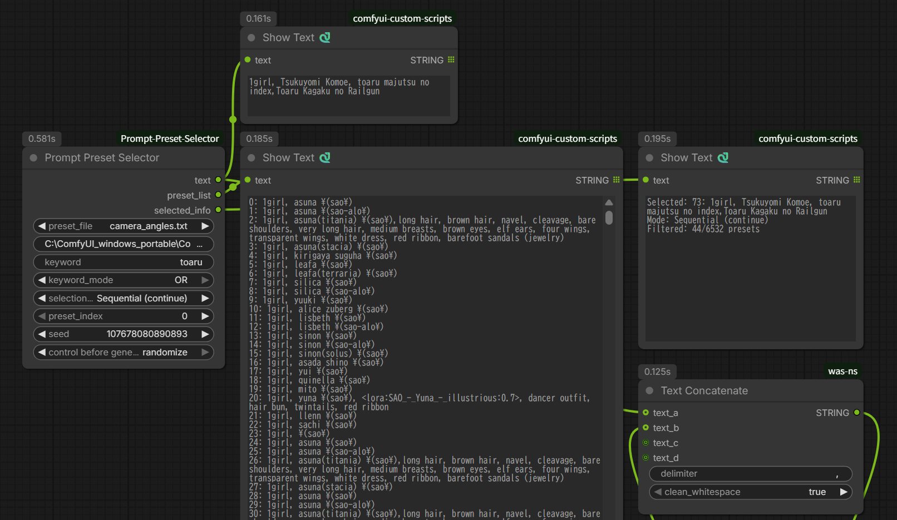

# ComfyUI Prompt Preset Selector

[English](README.md) | [日本語](README_ja.md)

外部ファイルからテキストプリセットを選択できる、柔軟なComfyUIノードです。フィルタリング機能を備え、カメラアングル、服装、ライティング設定、キャラクターデータベースなど、あらゆるテキストベースのプリセット管理に最適です。



## 機能

- 📁 **外部ファイル管理**: `.txt`、`.yaml`、`.yml`ファイルでプリセットを保存
- 🌐 **絶対パス対応**: システム上のどこにあるファイルでも使用可能
- 📝 **複数のYAML形式対応**: リスト、ネスト辞書、フラット形式に対応
- 🔍 **高度なキーワードフィルタリング**: キーワードの包含・除外、フレーズ検索に対応
- 🎲 **複数の選択モード**: Manual、Sequential、Sequential (continue)、Random
- 📝 **簡単な編集**: 任意のテキストエディタでプリセットを編集可能（Pythonコードの変更不要）
- 🗂️ **複数のプリセットファイル**: カテゴリ別にプリセットを整理
- 💬 **コメント対応**: プリセットファイルにコメントや空行を追加可能
- 🔄 **動的読み込み**: プリセットファイル編集時にComfyUIの再起動不要

## インストール

1. ComfyUIのカスタムノードディレクトリに移動：
```bash
cd ComfyUI/custom_nodes
```

2. このリポジトリをクローン：
```bash
git clone https://github.com/YOUR_USERNAME/ComfyUI-Prompt-Preset-Selector.git
```

3. （オプション）PyYAMLをインストール（YAML対応用、未インストールの場合）：
```bash
pip install pyyaml
```

注意：PyYAMLは既に環境にインストールされている場合がほとんどです。YAMLファイルが読み込めない場合、ノードが警告を表示します。

4. ComfyUIを再起動

## 使い方

### 基本的な使い方

1. ワークフローに **"Prompt Preset Selector"** ノードを追加
2. **オプションA**: ドロップダウンからプリセットファイルを選択（例：`camera_angles.txt`）
   **オプションB**: `absolute_path`フィールドに絶対パスを入力（例：`/home/user/my_presets/styles.yaml`）
3. 実行モードを選択
4. `text`出力をプロンプトノードに接続

**注意**: `absolute_path`が指定されている場合、`preset_file`ドロップダウンより優先されます。

### 絶対パスの使用

システム上のどこにあるプリセットファイルでも使用できます：

```
/home/user/presets/camera_angles.txt
/mnt/shared/prompts/styles.yaml
C:\Users\YourName\Documents\presets\lighting.yml  (Windows)
```

対応ファイル形式：`.txt`、`.yaml`、`.yml`

### YAMLファイル形式

このノードは3つのYAML形式に対応しています：

#### 形式A: プリセットリスト
```yaml
presets:
  - front view, low-angle shot, close-up
  - back view, low-angle shot, close-up
  - side view, eye-level shot, medium shot
```

#### 形式B: フラットリスト
```yaml
- front view, low-angle shot, close-up
- back view, low-angle shot, close-up
- side view, eye-level shot, medium shot
```

#### 形式C: ネスト辞書
```yaml
camera_angles:
  close_up:
    - front view, low-angle shot, close-up
    - back view, low-angle shot, close-up
  wide_shot:
    - front view, high-angle shot, wide shot
    - back view, high-angle shot, wide shot

lighting:
  natural:
    - golden hour lighting, warm tones
    - overcast daylight, diffused light
  studio:
    - three-point lighting, neutral balance
```

**重要**: 形式Cでは、キー階層が各プリセットの先頭に追加されます：
- 結果：`camera_angles:close_up: front view, low-angle shot, close-up`
- これにより、キーで検索可能：`camera_angles:`、`close_up:`、`"camera angles":"close up"`
- スペースを含むキーはYAMLでクォートが必要：`"camera angles":`

すべての形式は自動的に単一のプリセットリストに変換されます。

### 実行モード

**Manual**
- `preset_index`を直接使用
- 特定のプリセットのテスト用

**Sequential**
- `preset_index`から開始、実行ごとにインクリメント
- ワークフロー再読み込み時に`preset_index`にリセット

**Sequential (continue)**
- 実行間で最後の位置から継続
- ワークフロー再読み込みまで状態を保持
- バッチ生成に便利

**Random**
- `seed`に基づいてランダムにプリセットを選択
- 同じseed = 同じ結果（再現可能）

### キーワードフィルタリング

キーワード検索でプリセットをフィルタ：

#### 基本モード
- **OFF**: フィルタなし（全プリセットを使用）
- **AND**: すべてのキーワードに一致
- **OR**: いずれかのキーワードに一致

#### 構文

**シンプルなキーワード**:
```
front                → "front"を含む行
front close-up       → AND: "front" かつ "close-up"
front, back          → OR: "front" または "back"
```

**フレーズ検索**（ダブルクォート使用）:
```
"low-angle shot"     → 完全フレーズに一致
front "eye-level"    → フレーズと単語の組み合わせ
```

**YAML キー階層検索**:

ネスト辞書を使用する場合、キーがプリセットテキストの先頭に追加されます：
```yaml
camera_angles:
  close_up:
    - front view, low-angle shot, close-up
```
結果：`camera_angles:close_up: front view, low-angle shot, close-up`

キーで検索：
```
camera_angles:              → camera_angles配下のすべてのプリセット
close_up:                   → 任意の階層のclose_upキー
camera_angles:close_up:     → 完全パス（ANDモードでスペース区切り）
"camera angles":            → スペースを含むキー（クォート使用）
"camera angles" "close up"  → 両方のキーが存在（ANDモード）
```

**除外**（マイナス接頭辞使用）:
```
front -wide          → "front"を含み、"wide"を除外
front -wide -medium  → 複数の除外
-wide -back          → 除外のみ（すべてから削除）
"front view" -"wide shot" → フレーズによる除外
camera_angles: -wide_shot:  → キーフィルタ + キー除外
```

#### フィルタリング規則
- キーワードは**大文字小文字を区別しない**
- 除外は**OR論理**を使用（いずれかに一致で除外）
- 除外は包含フィルタリングの**後**に適用
- **記述の順序は関係なし**: `front -wide` = `-wide front`
- 区切り文字：カンマ`,`またはスペース
- **YAML辞書キーは検索可能**: キーマッチングには`:`接尾辞を使用（例：`close_up:`）
- **キー内のスペース**: ダブルクォート使用（例：`"camera angles":`）

#### 例

| キーワード | モード | 結果 |
|---------|------|--------|
| `front close-up -wide` | AND | "front" かつ "close-up"を含み、"wide"を含まない |
| `front back -medium` | OR | "front" または "back"を含み、"medium"を含まない |
| `"front view" -"wide shot"` | AND | フレーズ "front view"を含み、フレーズ "wide shot"を含まない |
| `-wide` | OFF | "wide"を含まないすべての行 |
| `camera_angles:` | AND | camera_anglesキー配下のすべてのプリセット（YAML） |
| `"close up":` | AND | "close up"キーを持つすべてのプリセット（YAML、キー内スペース） |
| `lighting: -dramatic:` | AND | lightingキーのプリセット、dramaticキーを除外 |

### カスタムプリセットの作成

#### テキストファイル (.txt)

1. このノードディレクトリの`presets`フォルダに移動
2. 新しい`.txt`ファイルを作成（例：`my_presets.txt`）
3. プリセットを1行ずつ追加：

```txt
# これはコメントです - 無視されます

front view, low-angle shot, close-up
side view, eye-level shot, medium shot
back view, high-angle shot, wide shot

# 別のセクション
overhead view, bird's-eye view, establishing shot
```

#### YAMLファイル (.yaml / .yml)

構造化されたプリセットファイルをYAMLで作成：

```yaml
# ネスト辞書形式
camera_angles:
  close_up:
    - front view, low-angle shot, close-up
    - side view, low-angle shot, close-up
  
  medium_shot:
    - front view, eye-level shot, medium shot
    - side view, eye-level shot, medium shot
```

またはシンプルなリスト形式：

```yaml
presets:
  - front view, low-angle shot, close-up
  - side view, eye-level shot, medium shot
```

4. ComfyUIをリフレッシュまたは再起動
5. 新しいプリセットファイルがドロップダウンに表示されます

## プリセットファイル形式

### テキストファイル (.txt)
- **1行に1プリセット**
- **`#`で始まる行はコメント**（無視されます）
- **空行は無視**
- **UTF-8エンコーディング**対応（日本語などの国際文字）

### YAMLファイル (.yaml, .yml)
- **3つの対応形式**: プリセットリスト、フラットリスト、ネスト辞書
- **すべての形式が単一のプリセットリストに変換**されます
- **コメント対応**（`#`使用）
- **UTF-8エンコーディング**対応

## ノードパラメータ

| パラメータ | 型 | 説明 |
|-----------|------|-------------|
| `preset_file` | ドロップダウン | presetsディレクトリから使用するファイルを選択 |
| `absolute_path` | 文字列 | オプション：プリセットファイルへの絶対パス（preset_fileより優先） |
| `keyword` | 文字列 | フィルタリング用キーワード（フレーズと除外に対応） |
| `keyword_mode` | ドロップダウン | フィルタモード：OFF、AND、OR |
| `execution_mode` | ドロップダウン | プリセットの選択方法：Manual、Sequential、Sequential (continue)、Random |
| `preset_index` | 整数 | Manual/Sequentialモードの開始インデックス（0始まり） |
| `seed` | 整数 | 再現可能なランダム選択用のランダムシード |

## ノード出力

| 出力 | 型 | 説明 |
|--------|------|-------------|
| `text` | STRING | 選択されたプリセットテキスト |
| `preset_list` | STRING | すべての利用可能なプリセットの番号付きリスト（参照用） |
| `selected_info` | STRING | 選択の詳細（インデックス、モード、フィルタ統計） |

## 使用例

### プロンプトライブラリとして使用

過去に生成した良い画像のプロンプトをキー付きで保存・再利用：

```yaml
portraits:
  "girl_soft_lighting_20250115": masterpiece, best quality, 1girl, soft lighting, gentle smile, pastel colors, bokeh background, natural pose, detailed eyes, flowing hair
  "boy_dramatic_20250116": high contrast, 1boy, dramatic lighting, intense gaze, dark background, cinematic composition, sharp focus
  "fantasy_elf_20250117": fantasy art, elf girl, pointed ears, ethereal beauty, magic glow, forest background, detailed costume

landscapes:
  "sunset_beach_20250114": beautiful sunset, golden hour, ocean waves, dramatic sky, vibrant colors, peaceful atmosphere, photorealistic
  "cyberpunk_city_20250115": cyberpunk cityscape, neon lights, rain reflections, futuristic architecture, night scene, highly detailed

experimental:
  "abstract_colors_20250113": abstract art, vibrant colors, flowing shapes, dreamlike, artistic composition
```

**活用例**:
- `"girl_soft_lighting_20250115":` → 特定のプロンプト全文を呼び出し
- `portraits:` + Sequential → ポートレート系プロンプトを順番に試す
- `portraits:` + Random → 過去のポートレート作品からランダムに選択
- `lighting -dramatic` → "lighting"を含み、"dramatic"を含まないプロンプト

**メリット**:
- ✅ 成功したプロンプトを日付付きで記録
- ✅ 同じ設定で別バリエーションを簡単に生成
- ✅ 何が良かったか後から振り返りやすい
- ✅ チームで良いプロンプトを共有可能

過去の良い結果を体系的に管理し、創作活動を効率化できます！

### カメラアングルバリエーション
フィルタリングを使用してカメラアングルのバリエーションを体系的に生成：
```
Keyword: "close-up" -back
Mode: Sequential
→ バックビューを除くすべてのクローズアップショットを順番に選択
```

### アニメキャラクターデータベース
シリーズ別にキャラクタープロンプトを整理：
```yaml
anime:
  shonen:
    - luffy, straw hat, scar under eye, determined expression
    - naruto, blonde hair, whisker marks, orange jacket
    - goku, spiky black hair, orange gi, martial arts pose
  seinen:
    - spike spiegel, green hair, brown suit, cigarette
    - guts, black armor, huge sword, intense gaze
  slice_of_life:
    - yui hirasawa, brown hair, school uniform, guitar
```

**検索例**:
- `anime:` → すべてのアニメキャラクター
- `shonen:` → 少年漫画キャラクターのみ
- `shonen: -naruto` → NARUTO以外の少年漫画キャラクター
- `blonde -naruto` → NARUTO以外の金髪キャラクター
- `"slice_of_life":` → 日常系キャラクターのみ

特定のカテゴリからランダムに選択したい大規模なキャラクターデータベース管理に最適です！

### YAMLベースのスタイルライブラリ
複雑なスタイル階層を整理：
```yaml
styles:
  anime:
    - vibrant colors, bold outlines, expressive eyes
    - pastel tones, soft shading, cute aesthetic
  
  realistic:
    - photographic quality, detailed textures
    - high dynamic range, natural lighting
  
  artistic:
    - watercolor effect, soft edges, dreamy atmosphere
    - oil painting style, thick brushstrokes, rich colors
```

### 共有プリセットの絶対パス
チーム共有のプリセットファイルを使用：
```
absolute_path: /mnt/shared/company_presets/brand_styles.yaml
keyword: professional
→ 一元化されたプリセットライブラリにアクセス
```

### LoRA組み合わせ
```txt
<lora:style1:0.8>, anime style, vibrant colors
<lora:style2:1.0>, realistic, detailed
<lora:style3:0.9>, watercolor, soft edges
```

**注意**: このノードはLoRA構文を通常のテキストとして出力します。実際にLoRAを読み込んで適用するには、出力を`<lora:name:weight>`構文を解析できるLoRA対応ノードに接続してください。このノード自体はLoRA構文を処理せず、単にテキストを後段のノードに提供するだけです。

## ヒント

### preset_list出力の使用
`preset_list`を表示ノードに接続して、インデックス付きのすべての利用可能なプリセットを確認。用途：
- キーワードに一致するプリセットの確認
- 正しい`preset_index`値の検索
- フィルタ結果の検証

### selected_info出力の使用
実行の詳細を表示：
```
Selected: 5: front view, eye-level shot, close-up
Mode: Sequential (continue)
Filtered: 24/96 presets
```

### バッチ生成
キーワードフィルタリングとSequential (continue)モードを使用：
1. キーワードフィルタを設定（例：`"close-up" -back`）
2. Sequential (continue)モードを選択
3. 複数の生成をキューに追加
→ 各生成で次の一致するプリセットを使用

### 再現可能な結果
ランダム選択の場合：
1. Randomモードを使用
2. 良い結果が得られたらseed値をメモ
3. 同じseedを使用して完全に再現

## トラブルシューティング

**Q: プリセットのドロップダウンが空？**
A: このノードは整数の`preset_index`を使用し、テキストドロップダウンではありません。`preset_list`出力で利用可能なプリセットを確認してください。

**Q: キーワードが機能しない？**
A: `keyword_mode`がOFFではなく、ANDまたはORに設定されていることを確認してください。キーワードがプリセットファイルの実際のテキストと一致するか確認してください。

**Q: Sequential (continue)モードが継続しない？**
A: このモードはワークフローの再読み込み時にリセットされます。状態はアクティブなワークフロー実行中のみ保持されます。

**Q: 除外が機能しない？**
A: マイナス接頭辞を使用していることを確認：`-wide`（`- wide`ではない）。マイナスの後にスペースなし。

**Q: YAMLファイルが読み込まれない？**
A: PyYAMLがインストールされていることを確認：`pip install pyyaml`。YAML構文が有効か確認してください。ノードは3つの形式に対応（YAML形式セクション参照）。

**Q: 絶対パスが機能しない？**
A: 
- ファイルが指定されたパスに存在するか確認
- Windowsでもフォワードスラッシュ`/`を使用（またはバックスラッシュをエスケープ`\\`）
- ファイルが対応する拡張子を持つか確認：`.txt`、`.yaml`、`.yml`
- ファイルの読み取り権限があるか確認

**Q: YAMLネスト辞書の順序が違う？**
A: Python辞書は挿入順序を維持（Python 3.7+）しますが、変換処理は構造を走査します。順序はYAML構造の走査に依存します。

## 免責事項とサポートポリシー

### 免責事項

- このノードは**技術サポートなし**で提供されます
- 機能の保証はありません
- 将来のComfyUIアップデートとの互換性は保証されません
- バグレポートや機能リクエストに対応しない場合があります
- 自己責任で使用してください

### サポート状況

- ❌ issueやメールでの個別サポートなし
- ❌ バグ修正や機能追加の保証なし
- ✅ コードはオープンソース - 自由にフォーク・修正可能
- ✅ コミュニティディスカッション歓迎（返答の約束なし）

### 問題の報告

サポートは保証されませんが、以下が可能です:
1. リポジトリの既存issueを確認
2. このREADMEとトラブルシューティングセクションを確認
3. issueを開く（対応されない場合があります）
4. 自分でフォークして修正

## ライセンス

MIT License - 自由に使用、変更、配布できます。

